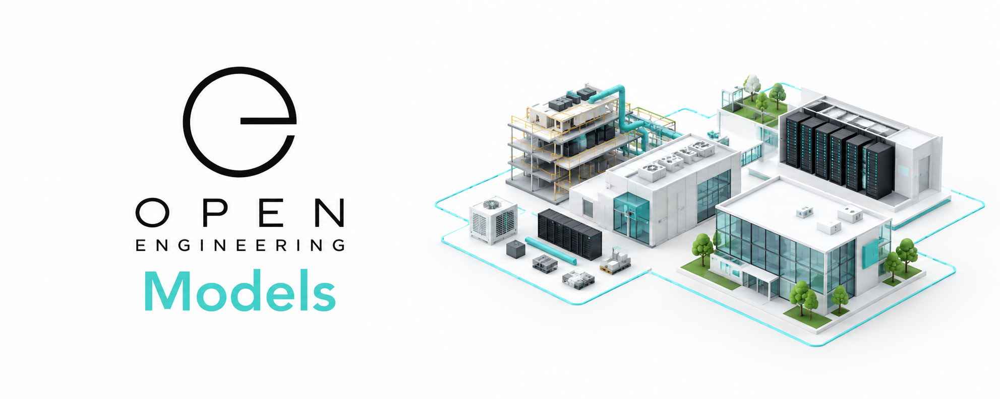

# Open Engineering Models

Engineering the physical world, one reusable model at a time.

Open Engineering Models is the 3D modeling foundation of the Open Engineering ecosystem.

We create open, reusable, composable 3D models of the things engineers design, build, operate, and understand — from individual components to complete buildings, infrastructure, systems, and digital worlds.

Model once. Compose everywhere.

⸻

🧱 A world made from models

Engineering becomes dramatically more powerful when things can be assembled from well-defined building blocks.

Open Engineering Models therefore takes inspiration from one of the world’s most successful systems of modular construction:

LEGO.

LEGO demonstrates the power of combining:

* precisely defined dimensions
* standardized interfaces
* reusable components
* consistent materials and colors
* hierarchical composition
* predictable geometry
* simple elements forming complex structures

We apply these principles to engineering models.

Instead of creating every visualization from scratch, we want an engineer — or an AI agent — to be able to say:

Give me a server. Give me a rack. Give me a building. Compose them.

And have a useful 3D model emerge from reusable, well-defined elements.

⸻

🧩 From elements to systems

Open Engineering Models provides the visual building blocks for the Open Engineering ecosystem.

                    OPEN ENGINEERING MODEL
                              │
                              ▼
                         Composition
                              │
             ┌────────────────┼────────────────┐
             ▼                ▼                ▼
          Element           Element          Element
             │                │                │
          ┌──┴──┐          ┌──┴──┐          ┌──┴──┐
          │     │          │     │          │     │
       Geometry Material  Geometry Material  Geometry Material
             │                │                │
             └────────────────┼────────────────┘
                              ▼
                         Complete Model
                              │
                              ▼
                         Babylon.js
                              │
                              ▼
                         Interactive World

A model is not simply a mesh.

It is a reusable engineering representation with:

* geometry
* dimensions
* materials
* semantic identity
* connection points
* metadata
* composition rules
* visual variants

This makes models useful to both humans and machines.

⸻

🌍 From LEGO to infrastructure

The long-term ambition is to make increasingly complex engineering environments constructible from a library of standardized models.

For example:

LEGO-inspired primitives
        │
        ├── bricks
        ├── plates
        ├── beams
        └── connectors
                │
                ▼
        Engineering elements
                │
        ├── server
        ├── rack
        ├── cable tray
        ├── door
        ├── window
        └── workstation
                │
                ▼
            Systems
                │
        ├── server room
        ├── office
        ├── laboratory
        └── factory
                │
                ▼
          Complete environments
                │
        ├── buildings
        ├── campuses
        ├── data centers
        └── infrastructure

The same principle can be applied recursively.

Small models become large models.

⸻

📐 A common engineering language

Standardization is essential.

Open Engineering Models aims to establish conventions for:

Dimensions

Models should use predictable, machine-readable dimensions and coordinate systems.

Materials

Materials should be reusable and consistently represented.

Colors

Colors should communicate meaningful engineering semantics where appropriate, while remaining visually coherent.

Interfaces

Models should expose well-defined connection and attachment points.

Coordinate systems

Models should follow consistent orientation, scale, origin, and grounding conventions.

Metadata

Every model should be capable of carrying semantic information alongside its geometry.

This allows models to participate in automated composition rather than being isolated visual assets.

⸻

🧱 LEGO as a framework

LEGO is particularly interesting to Open Engineering Models because it provides a real-world example of engineering through constrained composition.

The goal is not to reproduce LEGO itself.

The goal is to learn from its principles.

Standing on the shoulders of giants.

A LEGO-compatible dimensional framework can provide an initial foundation for:

* modular dimensions
* standardized attachment points
* predictable proportions
* reusable primitives
* automated composition
* spatial reasoning
* procedural generation

From there, the same ideas can be extended into engineering-specific model libraries.

⸻

🤖 Models for humans and AI

Open Engineering Models is designed for a future where AI agents can construct engineering environments.

Instead of generating arbitrary geometry, an agent should be able to reason in terms of known models:

Create a data center.
Add:
  4 buildings
  2 server rooms per building
  8 racks per server room
  20 servers per rack
  cooling units
  power distribution
  cable trays

The result should be assembled from known, validated models.

This creates an important distinction:

Generative geometry creates shapes.

Generative engineering composes meaning.

Open Engineering Models is interested in the latter.

⸻

🎨 GLB as the delivery format

Where appropriate, models are delivered as GLB/glTF assets.

GLB provides a practical interchange format for bringing reusable 3D models into modern applications and interactive environments.

Open Engineering applications can load these assets into Babylon.js and combine them into larger scenes.

Open Engineering Model
          │
          ▼
        GLB
          │
          ▼
      Babylon.js
          │
          ▼
   Interactive Scene

This makes the model library useful across:

* architecture visualization
* engineering visualization
* digital twins
* system architecture
* education
* simulations
* games
* virtual environments
* AI-generated worlds

⸻

🗺️ Part of the Open Engineering ecosystem

Open Engineering Models is one component in a larger ecosystem.

                     Open Engineering
                            │
        ┌───────────────────┼───────────────────┐
        │                   │                   │
   Definitions          Implementations       Models
        │                   │                   │
        │                   │                   ▼
        │                   │            Open Engineering
        │                   │                 Models
        │                   │                   │
        ▼                   ▼                   ▼
     Meaning             Behaviour          Geometry
        │                   │                   │
        └───────────────────┼───────────────────┘
                            ▼
                     Engineering World

Models provide the visual and spatial dimension of the ecosystem.

They can be connected to architecture definitions, systems, artifacts, characters, environments, and other Open Engineering representations.

⸻

🔭 Vision

We envision an open library where engineering models can be assembled as easily as building blocks.

A future Open Engineering application should be able to:

1. discover a model
2. understand its dimensions and semantics
3. instantiate it
4. connect it to other models
5. compose a larger system
6. render the result
7. modify the composition
8. regenerate the model automatically

Ultimately:

Engineering environments should be composable, inspectable, reproducible, and programmable.

⸻

🚀 Build with us

Open Engineering Models is an open project.

We welcome contributions in:

* 3D modeling
* engineering
* architecture
* CAD
* GLB/glTF
* Babylon.js
* procedural generation
* materials
* geometry
* metadata
* model standards
* AI-assisted modeling
* digital twins

Whether you create a single reusable component or an entire engineering environment, every model can become a building block for something bigger.

⸻

Open Engineering Models

Reusable models for a composable engineering world.

Open Engineering
| GitHub
| Open Engineering Models

Model once. Compose everywhere.
